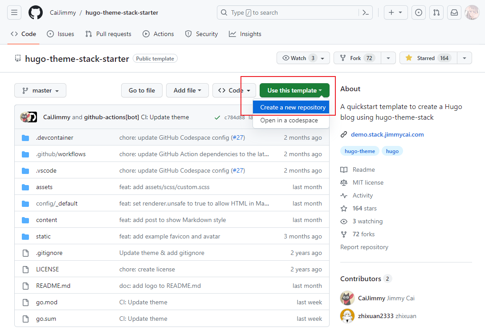
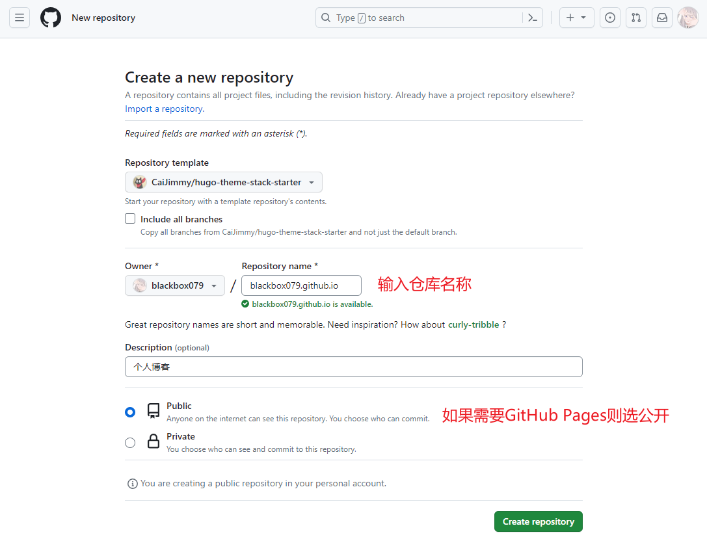
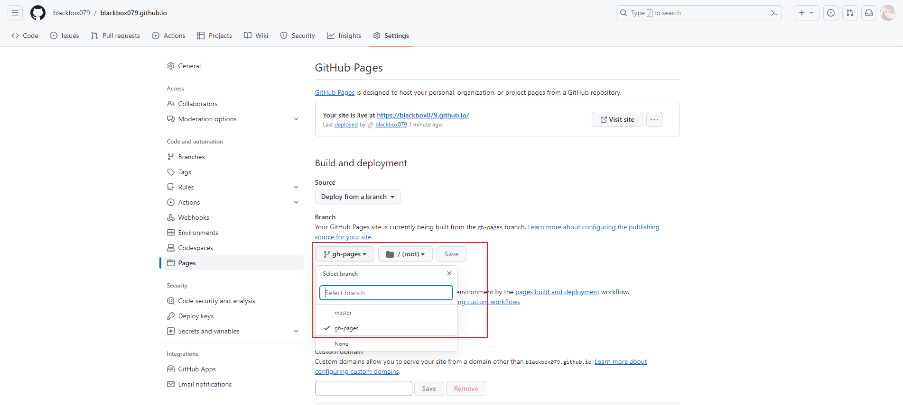
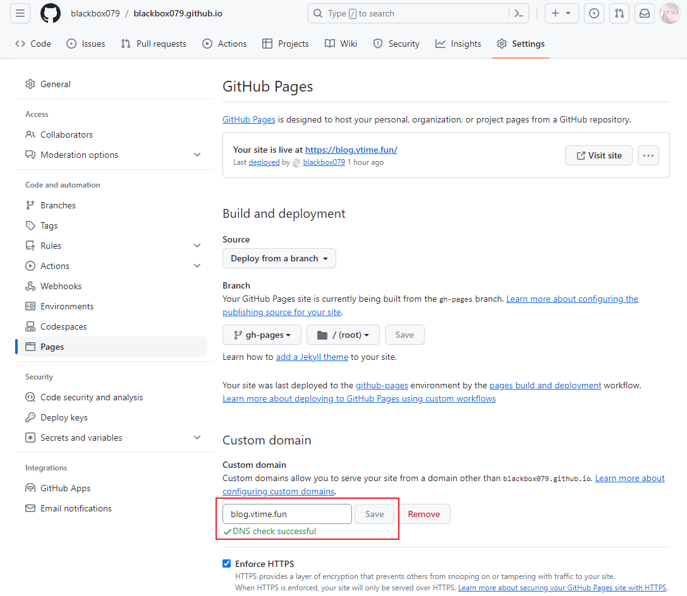

## 安装

- [Hugo](https://gohugo.io/) 框架
- [Stack](https://github.com/CaiJimmy/hugo-theme-stack) 主题

### 快速启动

主题提供[快速启动模板](https://github.com/CaiJimmy/hugo-theme-stack-starter)，点击 *Use this template* 并选择 *Create a new repository* 。



如需启用 GitHub Pages 则要将仓库设为公开。



### 常规安装

如果是在本地使用，则需要安装 *Git* 、 *Go* 和 *Hugo extended*  。[Scoop](https://scoop.sh/) 是Windows平台的包管理器，可以选择使用它来进行安装。

```bash
Set-ExecutionPolicy RemoteSigned -Scope CurrentUser #打开PowerShell远程权限
irm get.scoop.sh | iex #获取并安装Scoop
```

Scoop 使用示例：

- `scoop install hugo-extended` 安装Hugo
- `scoop update hugo-extended` 更新Hugo

创建站点并安装主题：

```bash
hugo new site Blog && cd Blog #新建站点并切换到该目录
git clone https://github.com/CaiJimmy/hugo-theme-stack/ themes/hugo-theme-stack #将主题下载到本地
git submodule add https://github.com/CaiJimmy/hugo-theme-stack/ themes/hugo-theme-stack #设置主题为Git子模块
```

## 配置

### 站点配置

配置文件为 */config/_default/* 目录下的文件，按需修改配置。

- *_languages.toml* 多语言
- *config.toml* 域名和语言
- *markup.toml* Markdown渲染器
- *menu.toml* 社交媒体
- *module.toml* 引入模块
- *params.toml* 常规配置
- *permalinks.toml* 链接地址
- *related.toml* 相关内容

### 修改FrontMatter

新建文件 */archetypes/default.md* ，粘贴新建博文的配置到该文件：    

```md
---
title: {{ replace .Name "-" " " | title }}
description: 
date: {{ .Date }}
categories: 
tags: ['']
image: 
slug: {{ substr (md5 (printf "%s%s" .Date (replace .TranslationBaseName "-" " " | title))) 4 8 }}
draft: true
---

```

## 使用

### 常用命令

- `hugo new post/1/index.md` 新建文章
- `hugo server -D` 运行本地服务器，-D表示包含草稿，-p可指定端口
- `hugo` 生成静态文件，默认目录为public
- `hugo version` 查看Hugo版本

## 部署

### GitHub Pages

如果仓库名是 *用户名.github.io* ，会自动启用 GitHub Pages 。进入仓库将部署的分支改为 *gh-pages* ，然后等待自动部署完成即可。



### 自定义域名

首先将域名 CNAME 解析到 GitHub Pages ：


然后在仓库设置中绑定该域名并启用强制HTTPS：



## 参考

- [Getting Started | Stack](https://stack.jimmycai.com/guide/getting-started)
- [关于自定义域名和 GitHub 页面 - GitHub 文档](https://docs.github.com/zh/pages/configuring-a-custom-domain-for-your-github-pages-site/about-custom-domains-and-github-pages)
- [Front matter | Hugo](https://gohugo.io/content-management/front-matter/)
- [Hugo 永久链接 - Ramen's Box](https://blog.lxdlam.com/post/9cc3283b/)
- [云解析 DNS 各记录类型说明及规则-操作指南-文档中心-腾讯云](https://cloud.tencent.com/document/product/302/38661)
