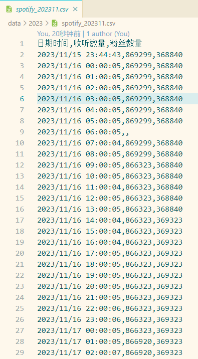

*puppeteer* 是由 *Chrome* 团队发布的 Node.js 库，通过 *DevTools* 协议来操作Chrome或Chromium浏览器。这里使用 **puppeteer** 来进行爬取，并通过 *Node.js* 将数据存储到文件。 

## 差异

可以使用 *axios* 判断网络环境，如果无法访问则在启动参数里加入代理 `--proxy-server=127.0.0.1:7890` 。

```js
async function checkNetwork() {
    try {
        await axios.get('https://open.spotify.com/');
        return true; // 如果能正常访问，返回true
    } catch (error) {
        return false; // 如果无法访问，返回false
    }
}
```

*puppeteer* 是通过无头浏览器（无图形界面的浏览器模式）来进行访问，需要安装Chrome或Chromium。本地直接安装就行，内地服务器无法打开 *google.com* 的话直接换成 *.cn* 域名后缀就行。

```bash
sudo wget https://dl.google.com/linux/direct/google-chrome-stable_current_x86_64.rpm
sudo yum localinstall -y google-chrome-stable_current_x86_64.rpm
```

指定Chrome路径并关闭沙盒，headless即为无头模式，可将值设为true或者new。

```js
const browser = await puppeteer.launch({
    executablePath: '/usr/bin/google-chrome-stable',
    headless: 'new',
    args: ['--no-sandbox']
});
```

## 代码

```js
const puppeteer = require('puppeteer');
const axios = require('axios');
const fs = require('fs');
const { resolve } = require('path');

// 简单判断环境
async function checkNetwork() {
    try {
        await axios.get('https://open.spotify.com/');
        return true; // 如果能正常访问，返回true
    } catch (error) {
        return false; // 如果无法访问，返回false
    }
}

// 设定是以年份为目录，将每个月的数据都放在同一个文件，如果文件不存在则创建。服务器可使用项目地址的绝对路径
// Excel无法识别不带BOM的UTF-8编码，所以需在文件头加入\ufeff。WPS都可以识别。
const currentDate = new Date();
const year = currentDate.getFullYear();
const month = (currentDate.getMonth() + 1).toString().padStart(2, '0');
const folderPath = `./data/${year}`;
const filePath = resolve(folderPath, `spotify_${year}${month}.csv`);
if (!fs.existsSync(filePath)) {
    fs.mkdirSync(folderPath, { recursive: true });
    fs.writeFileSync(filePath, '\ufeff日期时间,收听数量,粉丝数量\n', 'utf8');
}

// 净化数据，只保留数值
function pureData(text) {
    return text.replace(/(<([^>]+)>)/gi, '').replace(/[^\d]/g, '');
}

// 获取数据
async function getData() {
    const isNetworkAvailable = await checkNetwork();
    const browser = await puppeteer.launch({
        headless: 'new',
        executablePath: isNetworkAvailable?'/usr/bin/google-chrome-stable':'',
        args: isNetworkAvailable ? ['--no-sandbox'] : [`--proxy-server=127.0.0.1:7890`] //根据环境传递参数
    });
    // 只能通过移动端获取，所以将浏览器设定为移动端，并随机抽取ua
    const ualist = [
        'Mozilla/5.0 (iPhone; CPU iPhone OS 16_6 like Mac OS X) AppleWebKit/605.1.15 (KHTML, like Gecko) Version/16.6 Mobile/15E148 Safari/604.1',
        'Mozilla/5.0 (Linux; Android 13; V2183A; wv) AppleWebKit/537.36 (KHTML, like Gecko) Version/4.0 Chrome/87.0.4280.141 Mobile Safari/537.36 VivoBrowser/17.2.0.1',
        'Mozilla/5.0 (Android 13; Mobile; rv:120.0) Gecko/120.0 Firefox/120.0'
    ];
    const ua = ualist[Math.floor(Math.random() * ualist.length)];
    const page = await browser.newPage();
    await page.setViewport({ width: 375, height: 667, isMobile: true });
    await page.setUserAgent(ua);

    try {
        await page.goto('https://open.spotify.com/artist/0BezPR1Hn38i8qShQKunSD');
        const listenersElement = await page.$('[data-testid="monthly-listeners-label"]');
        const followersElement = await page.$(
            '[data-testid="artist-entity-view"]>div>div>div:nth-child(8)>p'
        );
        const listenersText = listenersElement
            ? await (await listenersElement.getProperty('textContent')).jsonValue()
            : 'N/A';
        const followersText = followersElement
            ? await (await followersElement.getProperty('textContent')).jsonValue()
            : 'N/A';
        const listeners = pureData(listenersText);
        const followers = pureData(followersText);
        return { listeners, followers };
    } catch (error) {
        console.error('出现错误:', error);
    } finally {
        await browser.close();
    }
}

// 写入数据
async function saveToCsvFile(listeners, followers) {
    console.log(new Date().toLocaleString(), listeners, followers);
    const data = `${new Date().toLocaleString('zh-CN')},${listeners},${followers}\n`;

    try {
        fs.appendFileSync(filePath, data, 'utf8');
        console.log(`数据已成功写入到 ${filePath} 文件！`);
    } catch (error) {
        console.error('写入文件时出现错误:', error);
    }
}

// 运行
async function processDataAndSave() {
    const { listeners, followers } = await getData();
    saveToCsvFile(listeners, followers);
}
processDataAndSave();
```

## 部署

由于是在node环境里的，所以运行命令为 `node spotify.js` 。可以放到 *package.json* 的scripts部分，部署后选择该命令为启动选项即可。设置定时任务之后就可以脱手了。



## 参考

- [Troubleshooting | Puppeteer](https://pptr.dev/troubleshooting/#setting-up-chrome-linux-sandbox)
- [Date - JavaScript | MDN](https://developer.mozilla.org/zh-CN/docs/Web/JavaScript/Reference/Global_Objects/Date)
